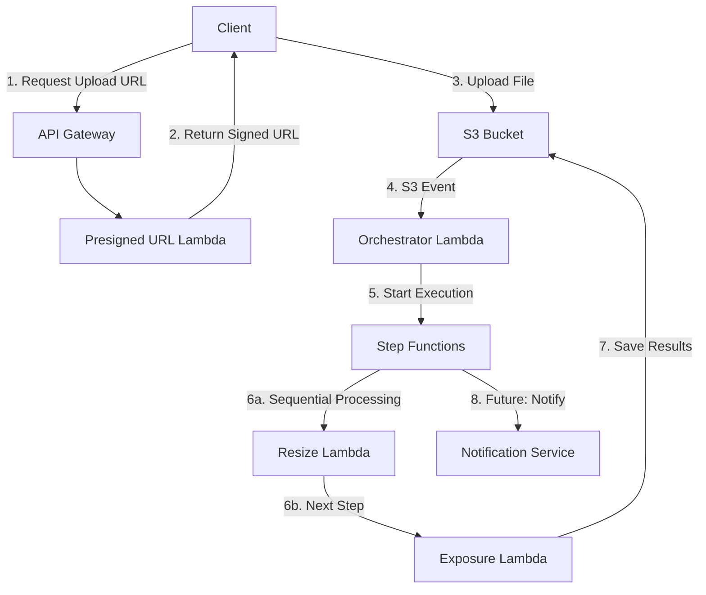

# CLAUDE.md

This file provides guidance to Claude Code (claude.ai/code) when working with code in this repository.

## Serverless File Processing Platform - FileFlow

## Common Commands

```bash
# Install dependencies (use pnpm only)
pnpm install

# Build all packages
pnpm build

# Build backend only
pnpm -F @file-flow/backend build

# Type checking
pnpm type-check

# Run tests
pnpm test

# Lint code
pnpm lint

# SAM commands (run from packages/backend)
cd packages/backend
pnpm build:sam        # Build SAM application
pnpm validate        # Validate SAM template
pnpm deploy:dev      # Deploy to dev environment
pnpm deploy:staging  # Deploy to staging environment
pnpm deploy:prod     # Deploy to production environment
pnpm dev            # Start SAM local API

# Build Sharp Lambda Layer (run from packages/backend)
cd packages/backend/layers/sharp
./build.sh
```

## Project Structure

This is a **pnpm workspace monorepo** with the following structure:

```
file-flow/
├── packages/
│   └── backend/          # Serverless backend (AWS SAM)
│       ├── src/
│       │   ├── handlers/ # Lambda function handlers
│       │   ├── shared/   # Shared utilities
│       │   └── types/    # TypeScript type definitions
│       ├── dist/         # Built JavaScript files
│       ├── layers/       # Lambda layers (Sharp)
│       ├── template.yaml # SAM template (Infrastructure as Code)
│       └── samconfig.toml # SAM deployment configuration
├── apps/
│   └── web/             # Frontend application (future)
├── pnpm-workspace.yaml  # pnpm workspace configuration
└── package.json         # Root package.json
```

## Executive Summary

This document outlines the implementation of a serverless file processing platform on AWS. The system allows users to upload images via presigned URLs, processes them through a series of transformations (resize, exposure adjustment), and stores both original and processed versions in S3. The architecture leverages AWS Step Functions for orchestration, Lambda for processing, and S3 for storage.

**Key Technologies:** AWS Lambda, Step Functions, S3, API Gateway, SAM, TypeScript, Node.js 18+, pnpm

**Processing Volume:** 10-100 images/day initially, 4K image size limit (~25MB max)

**Latency Requirement:** Minutes (not seconds)

## Solution Architecture



### Architecture Decisions

1. **Step Functions Express Workflows**: Cost-effective for short-duration workflows (5-min limit)
2. **Sequential Processing**: Ensures predictable resource usage and transformation order
3. **S3 Event-Driven**: Simple trigger mechanism with built-in reliability
4. **Fat Handlers**: Self-contained Lambdas reduce complexity and improve testability
5. **TypeScript with esbuild**: Fast builds with type safety

## TypeScript Conventions

### Naming Convention

**Closures are named after the type they return, not prefixed with "create":**

```typescript
// ✅ GOOD: Function named after its return type
const presignedUrlHandler = (bucket: string): APIGatewayProxyHandler => {
  return async (event) => { /* ... */ };
};

const s3Service = (client: S3Client): S3Service => ({
  getObject: async () => { /* ... */ },
  putObject: async () => { /* ... */ },
});

// ❌ BAD: Prefixing with "create"
const createPresignedUrlHandler = (bucket: string): APIGatewayProxyHandler => {
  return async (event) => { /* ... */ };
};

const createS3Service = (client: S3Client): S3Service => ({
  getObject: async () => { /* ... */ },
  putObject: async () => { /* ... */ },
});
```

### Core Principles

```typescript
// ✅ GOOD: Function returning object for shared state
const service = (config: Config) => ({
  process: async (data: Data) => {
    /* ... */
  },
  validate: (input: Input) => {
    /* ... */
  },
});

// ❌ BAD: Class-based approach
class Service {
  constructor(private config: Config) {}
  process(data: Data) {
    /* ... */
  }
}

// ✅ GOOD: Handler as closure
export const handler =
  (deps: Dependencies): Handler =>
  async (event) => {
    // Handler implementation
  };

// ✅ GOOD: Interface matching AWS SDK
interface S3Service {
  getObject(params: GetObjectCommandInput): Promise<GetObjectCommandOutput>;
  putObject(params: PutObjectCommandInput): Promise<PutObjectCommandOutput>;
}

// ✅ GOOD: Discriminated unions for type safety
type ProcessingResult =
  | { status: "success"; outputKey: string }
  | { status: "error"; error: string }
  | { status: "retry"; reason: string };

// ✅ GOOD: Const assertions for string unions
const OPERATIONS = ["resize", "adjustExposure"] as const;
type Operation = (typeof OPERATIONS)[number];
```

### Directory Structure

```
src/
├── upload/
│   ├── presigned-url.ts
│   └── types.ts
├── processing/
│   ├── orchestrator.ts
│   ├── resize.ts
│   ├── exposure.ts
│   └── types.ts
├── shared/
│   ├── s3.ts
│   └── types.ts
└── config/
    └── index.ts
```

## Feature Backlog

### Epic 1: Core Infrastructure Setup

#### Story 1.1: AWS Infrastructure Foundation

**Assignee:** terraform-specialist  
**Points:** 8  
**Priority:** P0

**Description:** Set up base AWS infrastructure using SAM template including S3 buckets, IAM roles, and networking configuration.

**Acceptance Criteria:**

- [ ] SAM template created with all required resources
- [ ] S3 bucket configured with proper lifecycle policies
- [ ] IAM roles follow least-privilege principle
- [ ] CloudWatch log groups configured
- [ ] Stack can be deployed via `sam deploy`

**Implementation Details:**

```yaml
# template.yaml
AWSTemplateFormatVersion: "2010-09-09"
Transform: AWS::Serverless-2016-10-31

Parameters:
  Environment:
    Type: String
    Default: dev
    AllowedValues: [dev, staging, prod]

Globals:
  Function:
    Runtime: nodejs18.x
    MemorySize: 1024
    Timeout: 30
    Tracing: Active
    Environment:
      Variables:
        ENVIRONMENT: !Ref Environment
        LOG_LEVEL: INFO

Resources:
  FileStorageBucket:
    Type: AWS::S3::Bucket
    Properties:
      BucketName: !Sub "${AWS::StackName}-files-${Environment}"
      VersioningConfiguration:
        Status: Enabled
      LifecycleConfiguration:
        Rules:
          - Id: DeleteOldVersions
            Status: Enabled
            NoncurrentVersionExpirationInDays: 30
          - Id: TransitionToIA
            Status: Enabled
            Transitions:
              - StorageClass: STANDARD_IA
                TransitionInDays: 60
      PublicAccessBlockConfiguration:
        BlockPublicAcls: true
        BlockPublicPolicy: true
        IgnorePublicAcls: true
        RestrictPublicBuckets: true
      NotificationConfiguration:
        LambdaConfigurations:
          - Event: s3:ObjectCreated:*
            Filter:
              S3Key:
                Rules:
                  - Name: prefix
                    Value: uploads/
            Function: !GetAtt OrchestratorFunction.Arn
```

---

#### Story 1.2: TypeScript Build Pipeline

**Assignee:** typescript-pro  
**Points:** 5  
**Priority:** P0

**Description:** Configure TypeScript build pipeline with esbuild and type checking.

**Acceptance Criteria:**

- [ ] TypeScript configuration optimized for Lambda
- [ ] esbuild configuration for fast builds
- [ ] Type checking separated from build process
- [ ] Source maps configured for debugging
- [ ] Build outputs to `dist/` directory

**Implementation Details:**

```json
// tsconfig.json
{
  "compilerOptions": {
    "target": "ES2022",
    "module": "commonjs",
    "lib": ["ES2022"],
    "outDir": "./dist",
    "rootDir": "./src",
    "strict": true,
    "esModuleInterop": true,
    "skipLibCheck": true,
    "forceConsistentCasingInFileNames": true,
    "resolveJsonModule": true,
    "moduleResolution": "node",
    "sourceMap": true,
    "declaration": true,
    "noUnusedLocals": true,
    "noUnusedParameters": true,
    "noImplicitReturns": true,
    "noFallthroughCasesInSwitch": true
  },
  "include": ["src/**/*"],
  "exclude": ["node_modules", "dist", "**/*.test.ts"]
}
```

```javascript
// build.js
const esbuild = require("esbuild");
const { nodeExternalsPlugin } = require("esbuild-node-externals");

const build = async () => {
  await esbuild.build({
    entryPoints: [
      "src/upload/presigned-url.ts",
      "src/processing/orchestrator.ts",
      "src/processing/resize.ts",
      "src/processing/exposure.ts",
    ],
    bundle: true,
    platform: "node",
    target: "node18",
    outdir: "dist",
    sourcemap: true,
    minify: process.env.NODE_ENV === "production",
    plugins: [nodeExternalsPlugin()],
  });
};

build().catch(() => process.exit(1));
```

---

### Epic 2: File Upload System

#### Story 2.1: Presigned URL Generation

**Assignee:** backend-architect  
**Points:** 5  
**Priority:** P0

**Description:** Implement Lambda function to generate presigned URLs for S3 uploads.

**Acceptance Criteria:**

- [ ] API endpoint returns presigned URL with 1-hour expiration
- [ ] URL includes content-type and size restrictions
- [ ] Unique key generation prevents collisions
- [ ] Response includes upload key for tracking
- [ ] Input validation for file type and size

**Implementation Details:**

```typescript
// src/upload/presigned-url.ts
import { APIGatewayProxyHandler, APIGatewayProxyResult } from "aws-lambda";
import { S3Client, PutObjectCommand } from "@aws-sdk/client-s3";
import { getSignedUrl } from "@aws-sdk/s3-request-presigner";
import { randomUUID } from "crypto";

interface UploadRequest {
  filename: string;
  contentType: string;
  fileSize: number;
}

interface UploadResponse {
  uploadUrl: string;
  key: string;
  expiresAt: string;
}

const MAX_FILE_SIZE = 25 * 1024 * 1024; // 25MB for 4K images
const ALLOWED_CONTENT_TYPES = [
  "image/jpeg",
  "image/png",
  "image/webp",
] as const;

type AllowedContentType = (typeof ALLOWED_CONTENT_TYPES)[number];

const isAllowedContentType = (type: string): type is AllowedContentType =>
  ALLOWED_CONTENT_TYPES.includes(type as AllowedContentType);

const createPresignedUrlService = (bucket: string, client: S3Client) => ({
  generateUploadUrl: async (
    key: string,
    contentType: string,
    fileSize: number
  ): Promise<string> => {
    const command = new PutObjectCommand({
      Bucket: bucket,
      Key: key,
      ContentType: contentType,
      ContentLength: fileSize,
      Metadata: {
        "original-filename": key.split("/").pop() || "",
        "upload-timestamp": new Date().toISOString(),
      },
    });

    return getSignedUrl(client, command, { expiresIn: 3600 });
  },
});

export const handler =
  (bucket: string, s3Client: S3Client): APIGatewayProxyHandler =>
  async (event): Promise<APIGatewayProxyResult> => {
    try {
      const body = JSON.parse(event.body || "{}") as UploadRequest;

      // Validation
      if (!body.filename || !body.contentType || !body.fileSize) {
        return {
          statusCode: 400,
          body: JSON.stringify({
            error: "Missing required fields: filename, contentType, fileSize",
          }),
        };
      }

      if (!isAllowedContentType(body.contentType)) {
        return {
          statusCode: 400,
          body: JSON.stringify({
            error: `Invalid content type. Allowed: ${ALLOWED_CONTENT_TYPES.join(
              ", "
            )}`,
          }),
        };
      }

      if (body.fileSize > MAX_FILE_SIZE) {
        return {
          statusCode: 400,
          body: JSON.stringify({
            error: `File size exceeds maximum of ${
              MAX_FILE_SIZE / 1024 / 1024
            }MB`,
          }),
        };
      }

      const service = createPresignedUrlService(bucket, s3Client);
      const fileId = randomUUID();
      const timestamp = Date.now();
      const sanitizedFilename = body.filename.replace(/[^a-zA-Z0-9.-]/g, "_");
      const key = `uploads/${timestamp}-${fileId}-${sanitizedFilename}`;

      const uploadUrl = await service.generateUploadUrl(
        key,
        body.contentType,
        body.fileSize
      );

      const response: UploadResponse = {
        uploadUrl,
        key,
        expiresAt: new Date(Date.now() + 3600 * 1000).toISOString(),
      };

      return {
        statusCode: 200,
        headers: {
          "Content-Type": "application/json",
        },
        body: JSON.stringify(response),
      };
    } catch (error) {
      console.error("Error generating presigned URL:", error);
      return {
        statusCode: 500,
        body: JSON.stringify({ error: "Internal server error" }),
      };
    }
  };

// Factory function for Lambda handler
export const createHandler = (): APIGatewayProxyHandler => {
  const bucket = process.env.BUCKET_NAME;
  if (!bucket) {
    throw new Error("BUCKET_NAME environment variable is required");
  }

  const s3Client = new S3Client({
    region: process.env.AWS_REGION || "us-east-1",
  });

  return handler(bucket, s3Client);
};

// Export for Lambda
export const lambdaHandler = createHandler();
```

---

#### Story 2.2: API Gateway Configuration

**Assignee:** cloud-architect  
**Points:** 3  
**Priority:** P0

**Description:** Configure API Gateway for presigned URL endpoint with proper CORS and throttling.

**Acceptance Criteria:**

- [ ] POST endpoint at `/upload/presign`
- [ ] CORS configured for web clients
- [ ] Rate limiting: 100 requests per minute per IP
- [ ] Request/response validation
- [ ] API key required for production

**Implementation Details:**

```yaml
# SAM template addition
UploadApi:
  Type: AWS::Serverless::Api
  Properties:
    StageName: !Ref Environment
    Cors:
      AllowMethods: "'OPTIONS,POST'"
      AllowHeaders: "'Content-Type,X-Api-Key'"
      AllowOrigin: "'*'"
    ThrottleSettings:
      RateLimit: 100
      BurstLimit: 200
    DefinitionBody:
      openapi: 3.0.1
      info:
        title: File Processing API
        version: 1.0.0
      paths:
        /upload/presign:
          post:
            x-amazon-apigateway-integration:
              uri: !Sub "arn:aws:apigateway:${AWS::Region}:lambda:path/2015-03-31/functions/${PresignedUrlFunction.Arn}/invocations"
              httpMethod: POST
              type: aws_proxy
            requestBody:
              required: true
              content:
                application/json:
                  schema:
                    type: object
                    required:
                      - filename
                      - contentType
                      - fileSize
                    properties:
                      filename:
                        type: string
                      contentType:
                        type: string
                      fileSize:
                        type: number
```

---

### Epic 3: Processing Pipeline

#### Story 3.1: Step Functions Workflow

**Assignee:** backend-architect  
**Points:** 8  
**Priority:** P0

**Description:** Design and implement Step Functions state machine for sequential image processing.

**Acceptance Criteria:**

- [ ] Sequential execution of resize then exposure adjustment
- [ ] Retry logic with exponential backoff
- [ ] Error handling with detailed logging
- [ ] Timeout configuration per step
- [ ] Output includes all processed file locations

**Implementation Details:**

```json
// statemachine/processing.asl.json
{
  "Comment": "Sequential image processing workflow",
  "StartAt": "ValidateInput",
  "TimeoutSeconds": 300,
  "States": {
    "ValidateInput": {
      "Type": "Task",
      "Resource": "arn:aws:states:::lambda:invoke",
      "Parameters": {
        "FunctionName": "${ValidatorFunctionArn}",
        "Payload": {
          "bucket.$": "$.bucket",
          "key.$": "$.key"
        }
      },
      "Retry": [
        {
          "ErrorEquals": ["States.TaskFailed"],
          "IntervalSeconds": 2,
          "MaxAttempts": 2,
          "BackoffRate": 2.0
        }
      ],
      "Next": "ResizeImage",
      "Catch": [
        {
          "ErrorEquals": ["ValidationError"],
          "Next": "HandleError"
        }
      ]
    },
    "ResizeImage": {
      "Type": "Task",
      "Resource": "arn:aws:states:::lambda:invoke",
      "Parameters": {
        "FunctionName": "${ResizeFunctionArn}",
        "Payload": {
          "bucket.$": "$.bucket",
          "key.$": "$.key",
          "width": 1920,
          "height": 1080,
          "maintainAspectRatio": true
        }
      },
      "ResultPath": "$.resizeResult",
      "Retry": [
        {
          "ErrorEquals": ["States.TaskFailed"],
          "IntervalSeconds": 5,
          "MaxAttempts": 3,
          "BackoffRate": 2.0
        }
      ],
      "Next": "AdjustExposure",
      "Catch": [
        {
          "ErrorEquals": ["States.ALL"],
          "Next": "HandleError",
          "ResultPath": "$.error"
        }
      ]
    },
    "AdjustExposure": {
      "Type": "Task",
      "Resource": "arn:aws:states:::lambda:invoke",
      "Parameters": {
        "FunctionName": "${ExposureFunctionArn}",
        "Payload": {
          "bucket.$": "$.bucket",
          "key.$": "$.resizeResult.Payload.outputKey",
          "adjustment": 0.2
        }
      },
      "ResultPath": "$.exposureResult",
      "Retry": [
        {
          "ErrorEquals": ["States.TaskFailed"],
          "IntervalSeconds": 5,
          "MaxAttempts": 3,
          "BackoffRate": 2.0
        }
      ],
      "Next": "RecordSuccess"
    },
    "RecordSuccess": {
      "Type": "Pass",
      "Parameters": {
        "status": "success",
        "originalKey.$": "$.key",
        "processedFiles": {
          "resized.$": "$.resizeResult.Payload.outputKey",
          "adjusted.$": "$.exposureResult.Payload.outputKey"
        },
        "completedAt.$": "$$.State.EnteredTime"
      },
      "End": true
    },
    "HandleError": {
      "Type": "Pass",
      "Parameters": {
        "status": "failed",
        "originalKey.$": "$.key",
        "error.$": "$.error",
        "failedAt.$": "$$.State.EnteredTime"
      },
      "End": true
    }
  }
}
```

---

#### Story 3.2: Orchestrator Lambda

**Assignee:** typescript-pro  
**Points:** 5  
**Priority:** P0

**Description:** Implement Lambda function triggered by S3 events to start Step Functions execution.

**Acceptance Criteria:**

- [ ] Triggers on S3 object creation in uploads/ prefix
- [ ] Starts Step Functions execution with proper input
- [ ] Handles concurrent uploads gracefully
- [ ] Implements idempotency to prevent duplicate processing
- [ ] Comprehensive error logging

**Implementation Details:**

```typescript
// src/processing/orchestrator.ts
import { S3Handler, S3EventRecord } from "aws-lambda";
import { SFNClient, StartExecutionCommand } from "@aws-sdk/client-sfn";
import { createHash } from "crypto";

interface ProcessingInput {
  bucket: string;
  key: string;
  contentType: string;
  size: number;
  uploadedAt: string;
}

const createStepFunctionsService = (
  client: SFNClient,
  stateMachineArn: string
) => ({
  startExecution: async (input: ProcessingInput): Promise<string> => {
    // Generate idempotent execution name
    const executionName = createHash("md5")
      .update(`${input.bucket}-${input.key}`)
      .digest("hex");

    const command = new StartExecutionCommand({
      stateMachineArn,
      name: `img-process-${executionName}-${Date.now()}`,
      input: JSON.stringify(input),
    });

    const response = await client.send(command);
    return response.executionArn || "";
  },
});

const processS3Record = async (
  record: S3EventRecord,
  service: ReturnType<typeof createStepFunctionsService>
): Promise<void> => {
  const { bucket, object } = record.s3;

  // Skip if not in uploads folder
  if (!object.key.startsWith("uploads/")) {
    console.log(`Skipping non-upload object: ${object.key}`);
    return;
  }

  const input: ProcessingInput = {
    bucket: bucket.name,
    key: decodeURIComponent(object.key.replace(/\+/g, " ")),
    contentType: record.s3.object.contentType || "image/jpeg",
    size: object.size,
    uploadedAt: record.eventTime,
  };

  console.log("Starting processing for:", input);
  const executionArn = await service.startExecution(input);
  console.log("Started execution:", executionArn);
};

export const handler =
  (stateMachineArn: string, sfnClient: SFNClient): S3Handler =>
  async (event) => {
    const service = createStepFunctionsService(sfnClient, stateMachineArn);

    const promises = event.Records.map((record) =>
      processS3Record(record, service).catch((error) => {
        console.error(
          `Failed to process record ${record.s3.object.key}:`,
          error
        );
        // Don't throw to allow other records to process
        return Promise.resolve();
      })
    );

    await Promise.all(promises);
  };

export const createHandler = (): S3Handler => {
  const stateMachineArn = process.env.STATE_MACHINE_ARN;
  if (!stateMachineArn) {
    throw new Error("STATE_MACHINE_ARN environment variable is required");
  }

  const sfnClient = new SFNClient({
    region: process.env.AWS_REGION || "us-east-1",
  });

  return handler(stateMachineArn, sfnClient);
};

export const lambdaHandler = createHandler();
```

---

#### Story 3.3: Image Resize Lambda

**Assignee:** backend-architect  
**Points:** 5  
**Priority:** P0

**Description:** Implement Lambda function for image resizing using Sharp library.

**Acceptance Criteria:**

- [ ] Resizes images maintaining aspect ratio
- [ ] Supports JPEG, PNG, WebP formats
- [ ] Handles 4K source images efficiently
- [ ] Saves processed image with metadata
- [ ] Memory usage optimized for Lambda constraints

**Implementation Details:**

```typescript
// src/processing/resize.ts
import { Handler } from "aws-lambda";
import {
  S3Client,
  GetObjectCommand,
  PutObjectCommand,
} from "@aws-sdk/client-s3";
import sharp from "sharp";
import { Readable } from "stream";

interface ResizeEvent {
  bucket: string;
  key: string;
  width?: number;
  height?: number;
  maintainAspectRatio?: boolean;
}

interface ResizeResult {
  outputKey: string;
  dimensions: {
    width: number;
    height: number;
  };
  fileSize: number;
}

const streamToBuffer = async (stream: Readable): Promise<Buffer> => {
  const chunks: Buffer[] = [];
  for await (const chunk of stream) {
    chunks.push(Buffer.from(chunk));
  }
  return Buffer.concat(chunks);
};

const createImageProcessor = () => ({
  resize: async (
    input: Buffer,
    width?: number,
    height?: number,
    maintainAspectRatio = true
  ): Promise<{ buffer: Buffer; metadata: sharp.Metadata }> => {
    const image = sharp(input);
    const metadata = await image.metadata();

    // Calculate dimensions
    let targetWidth = width || metadata.width || 1920;
    let targetHeight = height || metadata.height || 1080;

    if (maintainAspectRatio && metadata.width && metadata.height) {
      const aspectRatio = metadata.width / metadata.height;
      if (width && !height) {
        targetHeight = Math.round(width / aspectRatio);
      } else if (height && !width) {
        targetWidth = Math.round(height * aspectRatio);
      }
    }

    const buffer = await image
      .resize(targetWidth, targetHeight, {
        fit: maintainAspectRatio ? "inside" : "fill",
        withoutEnlargement: true,
      })
      .jpeg({ quality: 90, progressive: true })
      .toBuffer();

    const outputMetadata = await sharp(buffer).metadata();

    return { buffer, metadata: outputMetadata };
  },
});

export const handler =
  (s3Client: S3Client): Handler<ResizeEvent, ResizeResult> =>
  async (event) => {
    console.log("Processing resize request:", event);

    try {
      // Download original image
      const getCommand = new GetObjectCommand({
        Bucket: event.bucket,
        Key: event.key,
      });

      const { Body, ContentType, Metadata } = await s3Client.send(getCommand);

      if (!Body) {
        throw new Error(`No body returned for ${event.key}`);
      }

      const inputBuffer = await streamToBuffer(Body as Readable);
      console.log(`Downloaded ${event.key}, size: ${inputBuffer.length}`);

      // Process image
      const processor = createImageProcessor();
      const { buffer: outputBuffer, metadata } = await processor.resize(
        inputBuffer,
        event.width,
        event.height,
        event.maintainAspectRatio
      );

      // Generate output key
      const outputKey = event.key
        .replace("uploads/", "processed/")
        .replace(
          /\.[^.]+$/,
          `-resized-${metadata.width}x${metadata.height}.jpg`
        );

      // Upload processed image
      const putCommand = new PutObjectCommand({
        Bucket: event.bucket,
        Key: outputKey,
        Body: outputBuffer,
        ContentType: "image/jpeg",
        Metadata: {
          ...Metadata,
          "processing-step": "resize",
          "original-key": event.key,
          dimensions: `${metadata.width}x${metadata.height}`,
          "processed-at": new Date().toISOString(),
        },
      });

      await s3Client.send(putCommand);
      console.log(`Uploaded resized image to ${outputKey}`);

      return {
        outputKey,
        dimensions: {
          width: metadata.width || 0,
          height: metadata.height || 0,
        },
        fileSize: outputBuffer.length,
      };
    } catch (error) {
      console.error("Error processing image:", error);
      throw error;
    }
  };

export const createHandler = (): Handler<ResizeEvent, ResizeResult> => {
  const s3Client = new S3Client({
    region: process.env.AWS_REGION || "us-east-1",
  });

  return handler(s3Client);
};

export const lambdaHandler = createHandler();
```

---

#### Story 3.4: Exposure Adjustment Lambda

**Assignee:** typescript-pro  
**Points:** 5  
**Priority:** P0

**Description:** Implement Lambda function for image exposure adjustment.

**Acceptance Criteria:**

- [ ] Adjusts image brightness/exposure
- [ ] Preserves image quality and format
- [ ] Handles edge cases (already bright/dark images)
- [ ] Maintains color accuracy
- [ ] Efficient memory usage

**Implementation Details:**

```typescript
// src/processing/exposure.ts
import { Handler } from "aws-lambda";
import {
  S3Client,
  GetObjectCommand,
  PutObjectCommand,
} from "@aws-sdk/client-s3";
import sharp from "sharp";
import { Readable } from "stream";

interface ExposureEvent {
  bucket: string;
  key: string;
  adjustment: number; // -1 to 1, where 0 is no change
}

interface ExposureResult {
  outputKey: string;
  adjustment: number;
  fileSize: number;
}

const streamToBuffer = async (stream: Readable): Promise<Buffer> => {
  const chunks: Buffer[] = [];
  for await (const chunk of stream) {
    chunks.push(Buffer.from(chunk));
  }
  return Buffer.concat(chunks);
};

const createExposureProcessor = () => ({
  adjustExposure: async (
    input: Buffer,
    adjustment: number
  ): Promise<Buffer> => {
    // Clamp adjustment to safe range
    const safeAdjustment = Math.max(-1, Math.min(1, adjustment));

    // Convert adjustment to Sharp's gamma value
    // gamma < 1 brightens, gamma > 1 darkens
    const gamma =
      safeAdjustment >= 0
        ? 1 - safeAdjustment * 0.5
        : 1 + Math.abs(safeAdjustment);

    return sharp(input)
      .gamma(gamma)
      .modulate({
        brightness: 1 + safeAdjustment * 0.3, // Subtle brightness adjustment
      })
      .toBuffer();
  },
});

export const handler =
  (s3Client: S3Client): Handler<ExposureEvent, ExposureResult> =>
  async (event) => {
    console.log("Processing exposure adjustment:", event);

    try {
      // Download image
      const getCommand = new GetObjectCommand({
        Bucket: event.bucket,
        Key: event.key,
      });

      const { Body, ContentType, Metadata } = await s3Client.send(getCommand);

      if (!Body) {
        throw new Error(`No body returned for ${event.key}`);
      }

      const inputBuffer = await streamToBuffer(Body as Readable);
      console.log(`Downloaded ${event.key}, size: ${inputBuffer.length}`);

      // Process image
      const processor = createExposureProcessor();
      const outputBuffer = await processor.adjustExposure(
        inputBuffer,
        event.adjustment
      );

      // Generate output key
      const outputKey = event.key.includes("processed/")
        ? event.key.replace(/\.[^.]+$/, `-exposure-adjusted.jpg`)
        : event.key
            .replace("uploads/", "processed/")
            .replace(/\.[^.]+$/, "-exposure-adjusted.jpg");

      // Upload processed image
      const putCommand = new PutObjectCommand({
        Bucket: event.bucket,
        Key: outputKey,
        Body: outputBuffer,
        ContentType: ContentType || "image/jpeg",
        Metadata: {
          ...Metadata,
          "processing-step": "exposure-adjustment",
          "adjustment-value": adjustment.toString(),
          "processed-at": new Date().toISOString(),
        },
      });

      await s3Client.send(putCommand);
      console.log(`Uploaded exposure-adjusted image to ${outputKey}`);

      return {
        outputKey,
        adjustment: event.adjustment,
        fileSize: outputBuffer.length,
      };
    } catch (error) {
      console.error("Error adjusting exposure:", error);
      throw error;
    }
  };

export const createHandler = (): Handler<ExposureEvent, ExposureResult> => {
  const s3Client = new S3Client({
    region: process.env.AWS_REGION || "us-east-1",
  });

  return handler(s3Client);
};

export const lambdaHandler = createHandler();
```

---

### Epic 4: Monitoring and Observability

#### Story 4.1: CloudWatch Dashboards

**Assignee:** devops-troubleshooter  
**Points:** 3  
**Priority:** P1

**Description:** Create CloudWatch dashboards for monitoring system health and performance.

**Acceptance Criteria:**

- [ ] Dashboard shows Lambda invocations, errors, duration
- [ ] Step Functions execution status and duration
- [ ] S3 upload/download metrics
- [ ] Cost tracking widgets
- [ ] Alarm status overview

---

#### Story 4.2: X-Ray Tracing

**Assignee:** performance-engineer  
**Points:** 3  
**Priority:** P1

**Description:** Implement distributed tracing across all Lambda functions and Step Functions.

**Acceptance Criteria:**

- [ ] X-Ray enabled on all Lambda functions
- [ ] Custom segments for S3 operations
- [ ] Trace correlation across Step Functions
- [ ] Performance bottleneck identification

---

### Epic 5: CI/CD Pipeline

#### Story 5.1: GitHub Actions Pipeline

**Assignee:** deployment-engineer  
**Points:** 5  
**Priority:** P0

**Description:** Implement CI/CD pipeline using GitHub Actions for automated testing and deployment.

**Acceptance Criteria:**

- [ ] Automated testing on PR
- [ ] TypeScript compilation and type checking
- [ ] SAM deployment to dev/staging/prod
- [ ] Rollback capability
- [ ] Environment-specific configurations

**Implementation Details:**

```yaml
# .github/workflows/deploy.yml
name: Deploy Serverless Application

on:
  push:
    branches: [main, develop]
  pull_request:
    branches: [main]

env:
  AWS_REGION: us-east-1
  NODE_VERSION: 18

jobs:
  test:
    runs-on: ubuntu-latest
    steps:
      - uses: actions/checkout@v3

      - name: Setup Node.js
        uses: actions/setup-node@v3
        with:
          node-version: ${{ env.NODE_VERSION }}
          cache: "npm"

      - name: Install dependencies
        run: npm ci

      - name: Run type checking
        run: npm run type-check

      - name: Run tests
        run: npm test

      - name: Run linting
        run: npm run lint

  build:
    needs: test
    runs-on: ubuntu-latest
    steps:
      - uses: actions/checkout@v3

      - name: Setup Node.js
        uses: actions/setup-node@v3
        with:
          node-version: ${{ env.NODE_VERSION }}
          cache: "npm"

      - name: Install dependencies
        run: npm ci

      - name: Build application
        run: npm run build

      - name: Upload build artifacts
        uses: actions/upload-artifact@v3
        with:
          name: dist
          path: dist/

  deploy-dev:
    needs: build
    if: github.ref == 'refs/heads/develop'
    runs-on: ubuntu-latest
    environment: development
    steps:
      - uses: actions/checkout@v3

      - name: Download build artifacts
        uses: actions/download-artifact@v3
        with:
          name: dist
          path: dist/

      - name: Setup SAM CLI
        uses: aws-actions/setup-sam@v2

      - name: Configure AWS credentials
        uses: aws-actions/configure-aws-credentials@v2
        with:
          aws-access-key-id: ${{ secrets.AWS_ACCESS_KEY_ID }}
          aws-secret-access-key: ${{ secrets.AWS_SECRET_ACCESS_KEY }}
          aws-region: ${{ env.AWS_REGION }}

      - name: Deploy to Dev
        run: |
          sam deploy \
            --stack-name file-processing-dev \
            --parameter-overrides Environment=dev \
            --no-confirm-changeset \
            --no-fail-on-empty-changeset

  deploy-prod:
    needs: build
    if: github.ref == 'refs/heads/main'
    runs-on: ubuntu-latest
    environment: production
    steps:
      - uses: actions/checkout@v3

      - name: Download build artifacts
        uses: actions/download-artifact@v3
        with:
          name: dist
          path: dist/

      - name: Setup SAM CLI
        uses: aws-actions/setup-sam@v2

      - name: Configure AWS credentials
        uses: aws-actions/configure-aws-credentials@v2
        with:
          aws-access-key-id: ${{ secrets.AWS_ACCESS_KEY_ID }}
          aws-secret-access-key: ${{ secrets.AWS_SECRET_ACCESS_KEY }}
          aws-region: ${{ env.AWS_REGION }}

      - name: Deploy to Production
        run: |
          sam deploy \
            --stack-name file-processing-prod \
            --parameter-overrides Environment=prod \
            --no-confirm-changeset \
            --no-fail-on-empty-changeset
```

---

### Epic 6: Testing Strategy

#### Story 6.1: Unit Tests

**Assignee:** test-automator  
**Points:** 5  
**Priority:** P1

**Description:** Implement comprehensive unit tests for all Lambda functions.

**Acceptance Criteria:**

- [ ] 80% code coverage minimum
- [ ] Mock AWS SDK calls
- [ ] Test error conditions
- [ ] Test input validation
- [ ] Performance benchmarks

**Implementation Example:**

```typescript
// src/processing/__tests__/resize.test.ts
import { handler } from "../resize";
import { S3Client } from "@aws-sdk/client-s3";

jest.mock("@aws-sdk/client-s3");
jest.mock("sharp");

describe("Resize Lambda", () => {
  let mockS3Client: jest.Mocked<S3Client>;

  beforeEach(() => {
    mockS3Client = new S3Client() as jest.Mocked<S3Client>;
    jest.clearAllMocks();
  });

  it("should resize image maintaining aspect ratio", async () => {
    // Test implementation
  });

  it("should handle S3 download errors", async () => {
    // Test implementation
  });
});
```

---

### Epic 7: Security

#### Story 7.1: Security Audit

**Assignee:** security-auditor  
**Points:** 5  
**Priority:** P1

**Description:** Perform security audit and implement recommendations.

**Acceptance Criteria:**

- [ ] IAM roles follow least privilege
- [ ] S3 bucket policies reviewed
- [ ] Secrets management implemented
- [ ] Input validation comprehensive
- [ ] OWASP top 10 compliance

---

### Epic 8: Documentation

#### Story 8.1: API Documentation

**Assignee:** api-documenter  
**Points:** 3  
**Priority:** P2

**Description:** Create OpenAPI documentation for all endpoints.

**Acceptance Criteria:**

- [ ] OpenAPI 3.0 specification
- [ ] Request/response examples
- [ ] Error code documentation
- [ ] Authentication details
- [ ] Rate limiting information

---

#### Story 8.2: Architecture Documentation

**Assignee:** docs-architect  
**Points:** 3  
**Priority:** P2

**Description:** Create comprehensive architecture documentation.

**Acceptance Criteria:**

- [ ] System architecture diagrams
- [ ] Data flow documentation
- [ ] Deployment guide
- [ ] Troubleshooting guide
- [ ] Performance tuning guide

---

## Development Guidelines

### Prerequisites

- **Node.js 18+**: Required for Lambda runtime compatibility
- **pnpm 8+**: Package manager for workspace management
- **AWS SAM CLI**: For local testing and deployment
  ```bash
  # Install SAM CLI (macOS)
  brew install aws-sam-cli
  
  # Install SAM CLI (other platforms)
  # See: https://docs.aws.amazon.com/serverless-application-model/latest/developerguide/install-sam-cli.html
  ```
- **AWS CLI**: Configured with appropriate credentials
  ```bash
  aws configure
  ```

### Local Development Setup

```bash
# Install dependencies (from root)
pnpm install

# Build backend
pnpm -F @file-flow/backend build

# Run type checking
pnpm type-check

# Run tests
pnpm test

# Start local API (from packages/backend)
cd packages/backend
pnpm dev

# Deploy to AWS (from packages/backend)
cd packages/backend
pnpm deploy:dev      # Deploy to dev environment
pnpm deploy:staging  # Deploy to staging environment
pnpm deploy:prod     # Deploy to production environment
```

### Environment Variables

```bash
# .env.development
BUCKET_NAME=file-processing-dev-files
STATE_MACHINE_ARN=arn:aws:states:us-east-1:123456789:stateMachine:processing-dev
LOG_LEVEL=DEBUG
ENVIRONMENT=dev

# .env.production
BUCKET_NAME=file-processing-prod-files
STATE_MACHINE_ARN=arn:aws:states:us-east-1:123456789:stateMachine:processing-prod
LOG_LEVEL=INFO
ENVIRONMENT=prod
```

## Performance Considerations

1. **Lambda Memory Allocation**

   - Presigned URL: 512MB (minimal processing)
   - Orchestrator: 512MB (minimal processing)
   - Resize: 2048MB (image processing intensive)
   - Exposure: 2048MB (image processing intensive)

2. **Concurrency Limits**

   - Reserved concurrency: 10 per function
   - Burst concurrency: Handle up to 100 simultaneous uploads

3. **Cost Optimization**
   - Use S3 Intelligent-Tiering for processed images
   - Implement lifecycle policies for temporary files
   - Monitor Lambda duration and optimize memory

## Security Best Practices

1. **IAM Policies**: Minimal permissions per function
2. **S3 Bucket**: Block public access, use encryption
3. **API Gateway**: API keys, rate limiting, CORS
4. **Secrets**: Use AWS Secrets Manager for sensitive data
5. **Logging**: No PII in CloudWatch logs

## Rollback Strategy

1. **Blue-Green Deployment**: Use SAM canary deployments
2. **Automated Rollback**: CloudWatch alarms trigger rollback
3. **Database Migrations**: N/A for this MVP
4. **Manual Rollback**: `sam deploy --stack-name [previous-version]`

## Success Metrics

- **Availability**: 99.9% uptime
- **Processing Time**: < 30 seconds per image
- **Error Rate**: < 1% of uploads
- **Cost**: < $100/month for expected volume

## Timeline

- **Week 1-2**: Infrastructure and upload system (Stories 1.1-2.2)
- **Week 3-4**: Processing pipeline (Stories 3.1-3.4)
- **Week 5**: Testing and monitoring (Stories 4.1-6.1)
- **Week 6**: Documentation and deployment (Stories 7.1-8.2)
